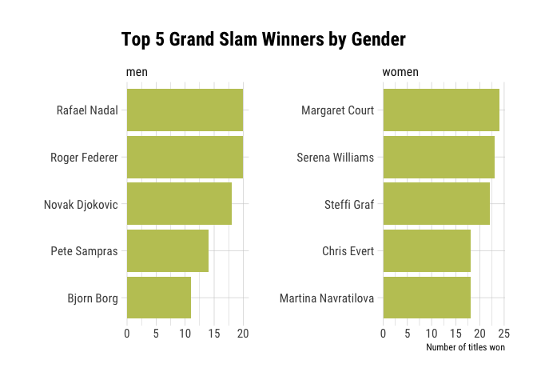
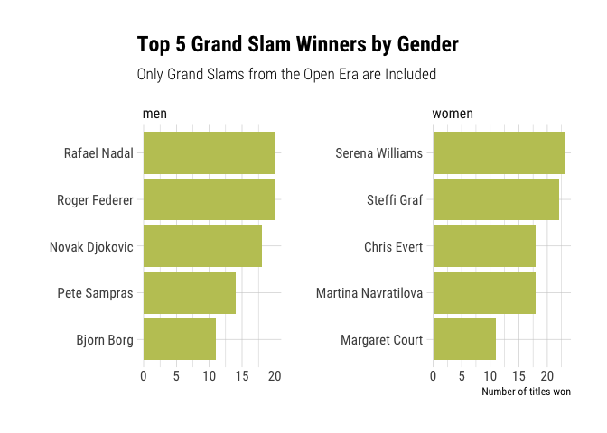

Are Roger and Serena the all-time best tennis players?
================
Your Teacher Today: Bobby Stuijfzand

## Before we begin

### Some steps to follow if you want to code along

1.  Go to <https://github.com/BobbyGlennS/fds-learner-lab> and download
    the repository.
2.  Unzip the repository and open the `fds-learner-lab.Rproj` file.
    RStudio should now start.
3.  From the `files` viewer inside RStudio, open the `leaner.Rmd` file.

### Beginning our R code

Load packages

``` r
library(lubridate)
library(tidyverse)
```

## Defining the question

In this webinar we will use data from the WTP and ATP to answer the
question:

***Who are the best tennis players of all-time?***

You might wonder, aren’t we asking whether Roger and Serena are the best
players? Not really. I applied something of a trick out of the hat of
journalists - a headline to lure people into this webinar. I prefer to
ask a slightly more open question, a question that isn’t simply answered
with yes or no, as with a similar amount of data analysis effort we will
learn a lot more!

To answer such a question, we need to put some definitions and
operationalisations in place. After all, we can mean different things
with what constitutes as the all-time best tennis player.

### The scope

Let’s first work out the exact scope of the question.

We will limit this question to each gender separately - we are not going
to compare between genders. I use this scope as genders do not compete
against each other, so there is no point in making a comparison.

We will further look at who won the grand slam single tournaments. We
could be more comprehensive, by incorporating rankings for example, but
it would not be feasible to do this within the time frame.

We’ve narrowed the scope of the question down to the resources we have
available, both data (more on that in a minute) and timewise.

### Sub questions

We will use two questions to get some insight into our main question.

-   Who won the most grand slam tournaments (single player)?
-   Who won the most grand slam tournaments consecutively?

After we have found answer to these questions, we can combine this
information to give a comprehensive answer to our main question.

## The data

### Credit where credit is due

The dataset we will be using is carefully assembled by [Jeff
Sackmann](https://github.com/JeffSackmann) and is freely available on
the internet in the form of github repositories. For reference - you can
find the sources for the full women and men data respectively here:

-   <https://github.com/JeffSackmann/tennis_wta>
-   <https://github.com/JeffSackmann/tennis_atp>

For this webinar I have already done all the pre-processing so we can
cut straight to the chase.

### Load the data

The data can be found in the `data` folder in the repository. There is a
file for the women (`wta_grandslam.csv`) and one for the men
(`atp_grandslam.csv`).

We’ll load this here.

``` r
data_wta <- read_csv("data/wta_grandslam.csv")
data_atp <- read_csv("data/atp_grandslam.csv")
```

Let’s now get a first glimpse of the data:

``` r
head(data_wta) %>% knitr::kable()
```

| tourney\_id | tourney\_name             | tourney\_level | tourney\_date | winner\_id | winner\_name            | round |
|:------------|:--------------------------|:---------------|--------------:|-----------:|:------------------------|:------|
| 1949-1014   | Australian Championships  | G              |      19490122 |     216619 | Doris Hart              | FALSE |
| 1949-1072   | Roland Garros             | G              |      19490518 |     226449 | Margaret Osborne Dupont | FALSE |
| 1949-1092   | Wimbledon                 | G              |      19490620 |     223860 | Louise Brough           | FALSE |
| 1949-1160   | US National Championships | G              |      19490829 |     226449 | Margaret Osborne Dupont | FALSE |
| 1950-1017   | Australian Championships  | G              |      19500120 |     223860 | Louise Brough           | FALSE |
| 1950-1092   | Roland Garros             | G              |      19500519 |     216619 | Doris Hart              | FALSE |

### Adding dates

For our second question, where we look at consecutive wins, we need to
have our data chronologically ordered. To ensure this is the case, we
can change the `tourney_date` column into a date type and then sort our
data.

``` r
data_wta <- data_wta %>% 
  mutate(date = ymd(tourney_date)) %>% 
  arrange(date)

data_atp <- data_atp %>% 
  mutate(date = ymd(tourney_date)) %>% 
  arrange(date)
```

Our data is now ready.

## First question: Who won the most grand slam tournaments (single player)?

------------------------------------------------------------------------

#### EXERCISE

What code would you use to get the top 5 winners for each gender?

``` r
# women
top5_wta <- data_wta %>%
  count(winner_name) %>% 
  slice_max(n, n = 5)

top5_wta
```

    ## # A tibble: 5 x 2
    ##   winner_name             n
    ##   <chr>               <int>
    ## 1 Margaret Court         24
    ## 2 Serena Williams        23
    ## 3 Steffi Graf            22
    ## 4 Chris Evert            18
    ## 5 Martina Navratilova    18

``` r
# men
top5_atp <- data_atp %>%
  count(winner_name) %>% 
  slice_max(n, n = 5)

top5_atp
```

    ## # A tibble: 5 x 2
    ##   winner_name        n
    ##   <chr>          <int>
    ## 1 Rafael Nadal      20
    ## 2 Roger Federer     20
    ## 3 Novak Djokovic    18
    ## 4 Pete Sampras      14
    ## 5 Bjorn Borg        11

### Add a visualisation

Let’s visualise these results.

``` r
bind_rows(
  "women" = top5_wta,
  "men" = top5_atp,
  .id = "gender"
) %>% 
  mutate(winner_name = fct_inorder(winner_name),
         winner_name = fct_rev(winner_name)) %>% 
  ggplot(aes(x = n, y = winner_name)) +
  geom_col(fill = "#C0C663") +
  facet_wrap(vars(gender), scale = "free") +
  hrbrthemes::theme_ipsum_rc() +
  labs(title = "Top 5 Grand Slam Winners by Gender",
       x = "Number of titles won",
       y = "")
```

<!-- -->

The results might be a bit surprising. If they do, you may want to
google ‘open era in tennis’ and see if you can work out why these
results are not what you expected them to be.

### Does it change with this aforementioned open era?

``` r
top_wta_open_era <- data_wta %>%
  filter(year(date) > 1967) %>% 
  count(winner_name) %>% 
  slice_max(n, n = 5)
```

``` r
top_atp_open_era <- data_atp %>%
  filter(year(date) > 1967) %>% 
  count(winner_name) %>% 
  slice_max(n, n = 5)
```

### Add a visualisation

Let’s visualise these results.

``` r
bind_rows(
  "women" = top_wta_open_era,
  "men" = top_atp_open_era,
  .id = "gender"
) %>% 
  mutate(winner_name = fct_inorder(winner_name),
         winner_name = fct_rev(winner_name)) %>% 
  ggplot(aes(x = n, y = winner_name)) +
  geom_col(fill = "#C0C663") +
  facet_wrap(vars(gender), scale = "free") +
  hrbrthemes::theme_ipsum_rc() +
  labs(title = "Top 5 Grand Slam Winners by Gender",
       subtitle = "Only Grand Slams from the Open Era are Included",
       x = "Number of titles won",
       y = "")
```

<!-- -->

------------------------------------------------------------------------

## Second question: Who won the most grand slam tournaments consecutively?

This question is a bit tougher to answer. We need to keep the following
things in mind:

-   An athlete can win once, then lose, and then win again. We don’t
    want these two wins to count towards the same streak.
-   An athlete can have multiple streaks, so the answer will not be as
    unambiguous as in the previous part.

I will demonstrate an approach in steps for the women. Then you can use
this as an exercise to solve it for the men.

### Step 1: Number each game consecutively

We need to figure out a way where we can compare each game with the
previous one. We can’t use date or year, there are multiple grandslams
in a year, and the interval between them is unequal, making it hard to
work with.

Instead, we will create a game id, numbering each consecutive game. This
approach also has as advantage that if we wanted to answer this question
for a subset of our data, e.g. one type of grand slam tournament, we can
reuse the same code on this subset.

We can use the function `row_number()` for this. Consider that our data
is already *chronologically ordered*, we did this when we created the
`date` column.

``` r
data_wta_cons <- data_wta %>% 
  mutate(game_id = row_number()) 
```

We now have a number for each game:

``` r
data_wta_cons %>% 
  head(10) %>% 
  select(tourney_name, date, game_id) %>% 
  knitr::kable()
```

| tourney\_name             | date       | game\_id |
|:--------------------------|:-----------|---------:|
| Australian Championships  | 1949-01-22 |        1 |
| Roland Garros             | 1949-05-18 |        2 |
| Wimbledon                 | 1949-06-20 |        3 |
| US National Championships | 1949-08-29 |        4 |
| Australian Championships  | 1950-01-20 |        5 |
| Roland Garros             | 1950-05-19 |        6 |
| Wimbledon                 | 1950-06-26 |        7 |
| US National Championships | 1950-08-27 |        8 |
| Australian Championships  | 1951-01-22 |        9 |
| Roland Garros             | 1951-05-23 |       10 |

### Step 2: Group our data by athlete

We want to evaluate *for each athlete individually* how many games they
won consecutively, so we will group the data by `winner_name` so that
our next steps are operated for each winner separately.

``` r
data_wta_cons <- data_wta_cons %>% 
  group_by(winner_name)
```

Before we continue, let’s have a look at the data.

``` r
data_wta_cons %>% 
  arrange(winner_name) %>% 
  head(10) %>% 
  select(winner_name, game_id, date) %>% 
  knitr::kable()
```

| winner\_name      | game\_id | date       |
|:------------------|---------:|:-----------|
| Althea Gibson     |       30 | 1956-05-15 |
| Althea Gibson     |       35 | 1957-06-24 |
| Althea Gibson     |       36 | 1957-08-29 |
| Althea Gibson     |       39 | 1958-06-23 |
| Althea Gibson     |       40 | 1958-08-29 |
| Amelie Mauresmo   |      229 | 2006-01-16 |
| Amelie Mauresmo   |      231 | 2006-06-26 |
| Ana Ivanovic      |      238 | 2008-05-26 |
| Anastasia Myskina |      222 | 2004-05-24 |
| Angela Mortimer   |       26 | 1955-05-23 |

### Step 3: Find the id of the previous game\_id

What we want to know is whether a game was the start of a streak, or
belonged to a streak. We can use `lag()` to find the previous `game_id`
an athlete has won. We use `default = -99` so that if there is no
previous game, we still have a value to work with. One that won’t mess
up our next calculations. This last part will make more sense a bit
later when you see the type of calculations we will perform on this
column.

> Sorry for the double negative in that explanation 🥴. It’s the way we
> have to work!

``` r
data_wta_cons <- data_wta_cons %>% 
  mutate(previous_game = lag(game_id, default = -99))
```

Let’s examine the data again:

``` r
data_wta_cons %>% 
  arrange(winner_name) %>% 
  head(10) %>% 
  select(winner_name, game_id, previous_game, date) %>% 
  knitr::kable()
```

| winner\_name      | game\_id | previous\_game | date       |
|:------------------|---------:|---------------:|:-----------|
| Althea Gibson     |       30 |            -99 | 1956-05-15 |
| Althea Gibson     |       35 |             30 | 1957-06-24 |
| Althea Gibson     |       36 |             35 | 1957-08-29 |
| Althea Gibson     |       39 |             36 | 1958-06-23 |
| Althea Gibson     |       40 |             39 | 1958-08-29 |
| Amelie Mauresmo   |      229 |            -99 | 2006-01-16 |
| Amelie Mauresmo   |      231 |            229 | 2006-06-26 |
| Ana Ivanovic      |      238 |            -99 | 2008-05-26 |
| Anastasia Myskina |      222 |            -99 | 2004-05-24 |
| Angela Mortimer   |       26 |            -99 | 1955-05-23 |

### Step 4: Is the current id the start of something new?

``` r
data_wta_cons <- data_wta_cons %>% 
  mutate(streak_begin = game_id - previous_game != 1)
```

Let’s examine the data again:

``` r
data_wta_cons %>% 
  arrange(winner_name) %>% 
  head(10) %>% 
  select(winner_name, game_id, previous_game, streak_begin) %>% 
  knitr::kable()
```

| winner\_name      | game\_id | previous\_game | streak\_begin |
|:------------------|---------:|---------------:|:--------------|
| Althea Gibson     |       30 |            -99 | TRUE          |
| Althea Gibson     |       35 |             30 | TRUE          |
| Althea Gibson     |       36 |             35 | FALSE         |
| Althea Gibson     |       39 |             36 | TRUE          |
| Althea Gibson     |       40 |             39 | FALSE         |
| Amelie Mauresmo   |      229 |            -99 | TRUE          |
| Amelie Mauresmo   |      231 |            229 | TRUE          |
| Ana Ivanovic      |      238 |            -99 | TRUE          |
| Anastasia Myskina |      222 |            -99 | TRUE          |
| Angela Mortimer   |       26 |            -99 | TRUE          |

### Intermezzo: the cumulative sum

For the next step, we are going to process the `streak_begin` variable
in a way that we will get a `streak_id` for each separate streak. In
order to do so we can use a function called `cumsum()` which calculates
the cumulative sum for a variable.

What is the cumulative sum?

Let’s demonstrate.

We have a vector containing the values `1, 2, 3, 4`.

Calculating the cumulative sum gives:

``` r
cumsum(c(1,2,3,4))
```

    ## [1]  1  3  6 10

The cumulative sum returns a vector of the same length, that contains
for each element the sum of the original vector *up until that point*.

How is this useful?

Consider that `TRUE` and `FALSE` are represented by `1` and `0` in R. A
cumulative sum on this vector of `0`s and `1`s:

``` r
cumsum(c(0, 1, 0, 0, 1))
```

    ## [1] 0 1 1 1 2

… will yield the same result as a cumulative sum on this *logical*
vector of `FALSE`s and `TRUE`s.

``` r
cumsum(c(FALSE, TRUE, FALSE, FALSE, TRUE))
```

    ## [1] 0 1 1 1 2

You can see that only once a `TRUE` appears will the cumulative sum
increment.

Now recall that in our `streak_begin` variable, we have a `TRUE` for
every start of a streak.

Let’s look at the data again:

``` r
data_wta_cons %>% 
  arrange(winner_name) %>% 
  head(10) %>% 
  select(winner_name, game_id, previous_game, streak_begin) %>% 
  knitr::kable()
```

| winner\_name      | game\_id | previous\_game | streak\_begin |
|:------------------|---------:|---------------:|:--------------|
| Althea Gibson     |       30 |            -99 | TRUE          |
| Althea Gibson     |       35 |             30 | TRUE          |
| Althea Gibson     |       36 |             35 | FALSE         |
| Althea Gibson     |       39 |             36 | TRUE          |
| Althea Gibson     |       40 |             39 | FALSE         |
| Amelie Mauresmo   |      229 |            -99 | TRUE          |
| Amelie Mauresmo   |      231 |            229 | TRUE          |
| Ana Ivanovic      |      238 |            -99 | TRUE          |
| Anastasia Myskina |      222 |            -99 | TRUE          |
| Angela Mortimer   |       26 |            -99 | TRUE          |

### Step 5: Get an id for each streak

If we run `cumsum()` on `streak_begin`, what we will get is a number
that increments with every new beginning. In other words: we have a
unique number for each streak 🎉

``` r
data_wta_cons <- data_wta_cons %>% 
  mutate(streak_id = cumsum(streak_begin))
```

Let’s admire our result.

``` r
data_wta_cons %>% 
  arrange(winner_name) %>% 
  head() %>% 
  select(winner_name, game_id, previous_game, streak_begin, streak_id) %>% 
  knitr::kable()
```

| winner\_name    | game\_id | previous\_game | streak\_begin | streak\_id |
|:----------------|---------:|---------------:|:--------------|-----------:|
| Althea Gibson   |       30 |            -99 | TRUE          |          1 |
| Althea Gibson   |       35 |             30 | TRUE          |          2 |
| Althea Gibson   |       36 |             35 | FALSE         |          2 |
| Althea Gibson   |       39 |             36 | TRUE          |          3 |
| Althea Gibson   |       40 |             39 | FALSE         |          3 |
| Amelie Mauresmo |      229 |            -99 | TRUE          |          1 |

### Step 6: Let’s count the streaks!

Now all that’s left is counting up the streak ids to understand how many
rows belonged to each streak, and therefore, how long each streak was!

``` r
data_wta_cons_result <- data_wta_cons %>% 
  count(streak_id, sort=TRUE)
```

Let’s admire the result

``` r
data_wta_cons_result %>% 
  head(20) %>% 
  knitr::kable()
```

| winner\_name        | streak\_id |   n |
|:--------------------|-----------:|----:|
| Margaret Court      |         10 |   6 |
| Martina Navratilova |          4 |   6 |
| Maureen Connolly    |          2 |   6 |
| Steffi Graf         |          2 |   5 |
| Serena Williams     |          2 |   4 |
| Serena Williams     |         13 |   4 |
| Steffi Graf         |          6 |   4 |
| Billie Jean King    |          2 |   3 |
| Billie Jean King    |          5 |   3 |
| Chris Evert         |         11 |   3 |
| Margaret Court      |          8 |   3 |
| Martina Hingis      |          2 |   3 |
| Martina Navratilova |          3 |   3 |
| Monica Seles        |          3 |   3 |
| Shirley Fry         |          2 |   3 |
| Steffi Graf         |          3 |   3 |
| Steffi Graf         |          7 |   3 |
| Steffi Graf         |          8 |   3 |
| Althea Gibson       |          2 |   2 |
| Althea Gibson       |          3 |   2 |

As we stored the results in a separate tibble, We can now also go back
to the original tibble to examine some individual streaks.

For example Serena Williams’ longest streak:

``` r
data_wta_cons %>% 
  filter(streak_id == 13) %>% 
  select(winner_name, date, tourney_name)
```

    ## # A tibble: 5 x 3
    ## # Groups:   winner_name [2]
    ##   winner_name     date       tourney_name   
    ##   <chr>           <date>     <chr>          
    ## 1 Chris Evert     1986-05-26 Roland Garros  
    ## 2 Serena Williams 2014-08-25 US Open        
    ## 3 Serena Williams 2015-01-19 Australian Open
    ## 4 Serena Williams 2015-05-25 Roland Garros  
    ## 5 Serena Williams 2015-06-29 Wimbledon

Hey! Why does Chris Evert appear? This is because the `streak_id` was
created on the grouped tibble. I could have ungrouped before counting
the streak ids, but I would have lost the names, so I didn’t do that.
`count()` does take into account existing grouping when computing
counts, so that decision did not affect our results.

## And now for the men…

------------------------------------------------------------------------

#### EXERCISE:

Can you answer the second question for the men?

------------------------------------------------------------------------

## Open era tennis results

------------------------------------------------------------------------

#### BONUS:

What would the results look like if we account for the switch to
allowing professionals to compete in grand slams?

Hint: the open era, as it was called, started in 1968.

------------------------------------------------------------------------
